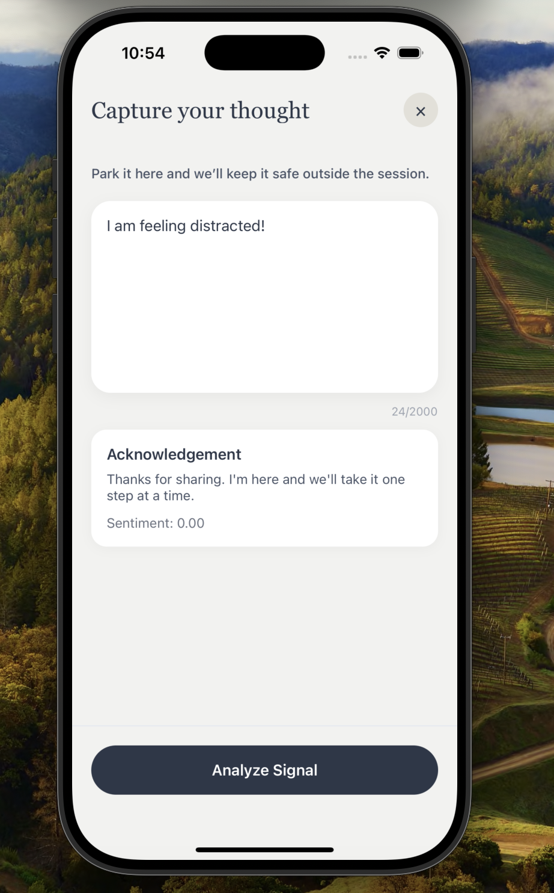
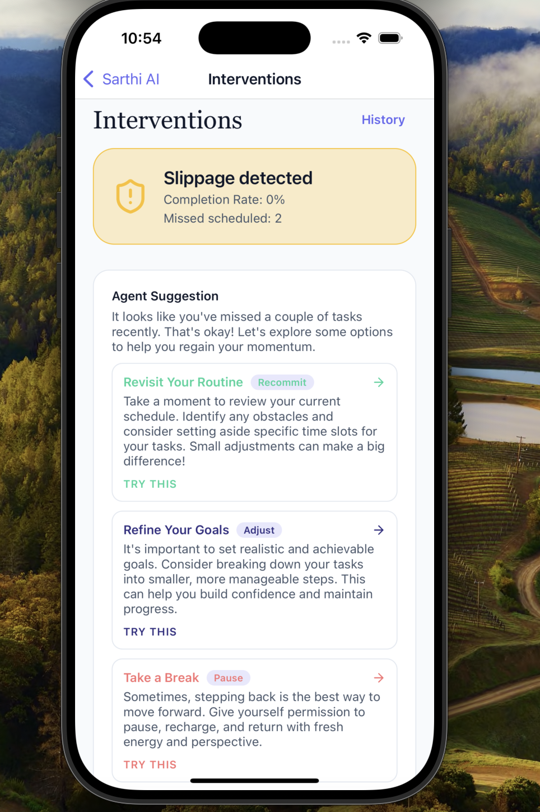

# Sarthi AI

Sarthi AI is an agentic resolution coach that helps people keep their commitments with supportive autonomy. The project couples a FastAPI backend (LLM-enabled planning, scheduler jobs, observability hooks) with an Expo/React Native client that mirrors the coaching experience end to end.

---

## Why It Exists

- **Dual intake** keeps the agent grounded: structured resolution setup plus free-form brain dumps feed a shared context.
- **Rolling Wave planning** decomposes resolutions into 4–12 week arcs, activates Week 1 tasks, and iterates each Sunday from observed performance.
- **Thursday interventions** detect slippage early and offer choices (reduce scope, reschedule, reflect) so users stay in control.
- **Transparency + guardrails** (`AgentActionLog`, preferences, pause controls, optional Opik traces) reinforce psychological safety.

---

## Architecture at a Glance

```
┌──────────────────────────────┐      ┌──────────────────────────────┐
│ Expo / React Native Client   │◀────▶│ FastAPI Backend (Python 3.11)│
│ • Brain dumps + resolutions  │      │ • REST / JSON APIs           │
│ • Plan review & approvals    │      │ • SQLAlchemy + Postgres      │
│ • Weekly plan & My Week      │      │ • OpenAI-powered agents      │
│ • Interventions & settings   │      │ • APScheduler worker         │
└──────────────────────────────┘      └──────────┬───────────────────┘
                                                 │
                              ┌──────────────────┴────────────┐
                              │ Persistence & Telemetry        │
                              │ • Postgres via SQLAlchemy ORM  │
                              │ • AgentActionLog transparency  │
                              │ • Optional Opik metrics/traces │
                              └────────────────────────────────┘
```

Key backend components live under `backend/app/`:

- `api/routes`: FastAPI routers (brain dumps, resolutions, tasks, weekly plan, interventions, jobs, preferences, notifications, agent log, dashboard).
- `services`: domain logic (LLM planners, decomposer, intervention handler, scheduler runners, notification hooks, task reminders, preference helpers).
- `worker/scheduler_main.py`: APScheduler worker that runs weekly-plan, intervention, and reminder jobs respecting preference flags.

The mobile client (React Native + TypeScript) lives under `mobile/` with screens that map directly to API workflows.

---

## Capabilities Checklist

- ✅ Brain dump ingestion with signal extraction + acknowledgement
- ✅ Resolution intake, LLM decomposition, plan approval flow
- ✅ Weekly plan preview/run/history endpoints + Rolling Wave task materialization
- ✅ Thursday slippage detection with actionable intervention options
- ✅ Intervention follow-up actions (reduce scope, reschedule, reflect) stored as agent logs
- ✅ AgentActionLog APIs + mobile transparency screens
- ✅ User preferences (pause coaching, weekly plans, interventions) enforced in schedulers & notifications
- ✅ Notifications plumbing with stub provider + Expo push token registry

---

## Backend Quickstart

```bash
# Prereqs: Python 3.11.7, Postgres running locally
cd backend
python3.11 -m venv .venv && source .venv/bin/activate
python -m pip install --upgrade pip setuptools wheel
python -m pip install -e .[dev]
cp .env.example .env  # configure DATABASE_URL, OpenAI keys, scheduler flags, etc.

# Apply migrations & run API
python -m alembic upgrade head
python -m uvicorn app.main:app --reload

# (Optional) start scheduler worker for cron jobs
python -m app.worker.scheduler_main

# Run tests
python -m pytest
```

Key env toggles (see `app/core/config.py`): `SCHEDULER_ENABLED`, `WEEKLY_JOB_*`, `INTERVENTION_JOB_*`, `JOBS_RUN_ON_STARTUP`, `OPIK_ENABLED`, `NOTIFICATIONS_ENABLED`, `TASK_REMINDER_*`.

---

## Mobile Quickstart

```bash
cd mobile
npm install
npm run start          # Expo dev server
# or npm run ios / npm run android
```

The app expects the backend to run at the base URL configured in `mobile/src/api/client.ts`. Key screens:

- **Home**: snapshot of today + quick links to Brain Dump, Draft Plans, My Week, Dashboard.
- **Resolution Create / Plan Review**: mirrors backend intake/decompose/approve flow.
- **My Week**: active task list with complete/note toggles.
- **Interventions**: latest snapshot, option buttons wired to `/interventions/respond`, history detail screens.
- **Settings**: autonomy toggles, push registration, Agent Action Log.

---

## Product Walkthrough (Screenshots)

### Home + Daily Flow

Here’s the landing screen of Sarthi, your supportive productivity coach. Because Sarthi understands your preferred contexts, it automatically highlights the current focus (Work or Personal) and lines up the most relevant hero task, quick actions, and praise nudges pulled from `/dashboard`, `/tasks`, and `/journey`. You can immediately jump into a Brain Dump, draft plans, interventions, or personalization without hunting for menus.

### Brain Dump Signal Extraction

When a random thought or blocker shows up, the Brain Dump screen is your pressure-release valve. You pour in raw text, Sarthi’s `BrainDumpExtractor` detects emotions, blockers, and intent shifts, then reflects empathetic acknowledgement plus optional next steps (never surprise tasks). If you accept an option, the backend routes it through `/tasks` or `/interventions/respond`, otherwise Sarthi simply notes the signal for future planning.

### Personalizing Your Flow

Don’t want Sarthi guessing blindly? The “Personalize Your Flow” settings let you declare work days, quiet hours, and when you prefer creative work vs hobbies. Those knobs feed into availability profiles so every Rolling Wave plan or Focus Mode session respects the cadence you set—and when you sync tasks to your calendar, they slot directly into the time blocks you approved.

### Rolling Wave Plan Review


Plan Review turns vague resolutions like “Learn piano” into a 4–12 week path. You set the timeline, Sarthi decomposes it using your personalized context, and you can edit any Week 1 task before activating. Approving calls `/resolutions/{id}/approve`, materializing tasks, logging the action, and allowing you to sync dated items to your device calendar so reminders fire at the right moment.

### Weekly Focus Snapshot


Every Sunday, Sarthi runs the second layer of personalization. The Weekly Plan screen fetches `/weekly-plan/latest` to show the micro-resolution focus, “why this matters,” and per-resolution stats so you know exactly where momentum is building or lagging. The dashboard “Weekly Overview” mirrors those numbers at a glance and bubbles up resolutions that need a nudge.

### Intervention Coach

Every Thursday, Sarthi runs an intervention check. If your week looks overloaded, `/interventions/latest` returns a card explaining the risk and three choices that keep agency with you: **Reschedule** automatically moves remaining tasks into your next free slots, **Reduce Load** trims scope for the week while logging a note, and **Short Break** parks the plan temporarily so you can recover guilt-free. Each button routes through `respondToIntervention` and records the outcome in `agent_actions_log`.

### Focus Mode + Calendar Sync

When it’s go-time, Focus Mode silences notifications, puts one task front-and-center, and lets you log distracting thoughts via a mini Brain Dump so Opik’s evaluation engine can learn what derailed you. Completing the session marks the task done through `/tasks` and automatically loads the next item in your queue. Combined with the calendar sync flow above, Focus Mode keeps you anchored to the schedule you designed while still adapting if life happens.

---

## Core APIs & Flows

| Flow | Endpoints | Notes |
| --- | --- | --- |
| Brain dump | `POST /brain-dump` | Stores `BrainDump` row, emits signals + agent log entry. |
| Resolutions | `POST /resolutions`, `POST /resolutions/{id}/decompose`, `POST /resolutions/{id}/approve`, `GET /resolutions` | Decomposer generates `plan_v1` + draft tasks; approval activates tasks + logs actions. |
| Weekly plan | `GET /weekly-plan/preview`, `POST /weekly-plan/run`, `GET /weekly-plan/latest`, history endpoints | Rolling Wave planner stores snapshots in `AgentActionLog` (`weekly_plan_generated`). Notifications fire via hooks when enabled. |
| Interventions | `GET /interventions/preview`, `POST /interventions/run`, `GET /interventions/latest`, history endpoints, `POST /interventions/respond` | Thursday slippage cards plus follow-up option execution. Responses log `intervention_executed`. |
| Tasks | `GET/POST/PATCH /tasks` | Supports completion toggles, edits, notes, metadata for draft vs active tasks. |
| Preferences | `GET /preferences`, `PATCH /preferences` | Autonomy controls reflected in scheduler + notifications. |
| Agent Log | `GET /agent-log`, `GET /agent-log/{id}` | Cursor-paginated transparency feed with summaries and undo flags. |
| Jobs (ops) | `GET /jobs`, `POST /jobs/run-now` (when `DEBUG=true`) | Inspect scheduler config or trigger runs manually. |

---

## Scheduler & Background Jobs

- **Weekly plan job**: regenerates Rolling Wave plans for active users each week (`app/services/job_runner.py`). Skips paused users via `UserPreferences`.
- **Intervention job**: runs Thursday 7 PM (configurable) to detect slippage and store snapshots.
- **Task reminder job**: optional Expo push reminders for tasks within a configurable lookahead (`app/services/task_reminder.py`).
- **Notifications**: Hooks (`app/services/notifications/hooks.py`) ensure weekly-plan/intervention snapshots enqueue notifications or log skips with reasons.

All jobs emit metrics (`jobs.*`) and traces when Opik is enabled.

---

## Transparency, Preferences & Safety

- Every autonomous action writes to `agent_actions_log` (weekly plans, interventions, notifications, task edits, preference updates).
- `AgentLog` APIs power the mobile transparency screens; entries note `undo_available` when relevant.
- Preferences (`coaching_paused`, `weekly_plans_enabled`, `interventions_enabled`) propagate through schedulers, notification hooks, and the task reminder service.
- `/jobs/run-now` respects these flags to avoid surprising users during manual testing.

---

## Additional Docs

- `docs/SRS_v2.5.pdf`: original system requirements + UX spec.
- `docs/project_structure.md`: tree view of the repo.
- `docs/backend_reference.md`: deep dive into backend modules and schema.
- `docs/decisions.md`: guiding architecture principles.

Use these references alongside this README to onboard quickly or extend Sarthi AI with new agents, notification providers, or analytics.
